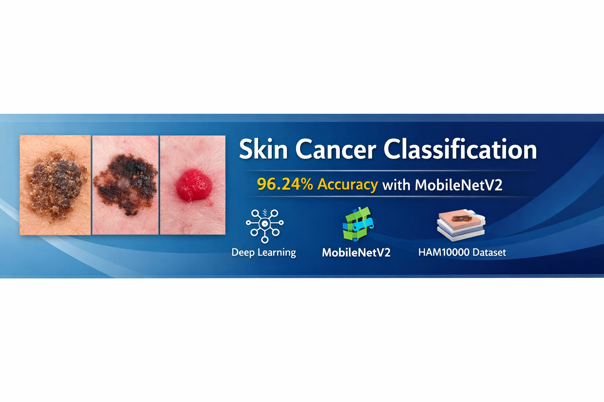
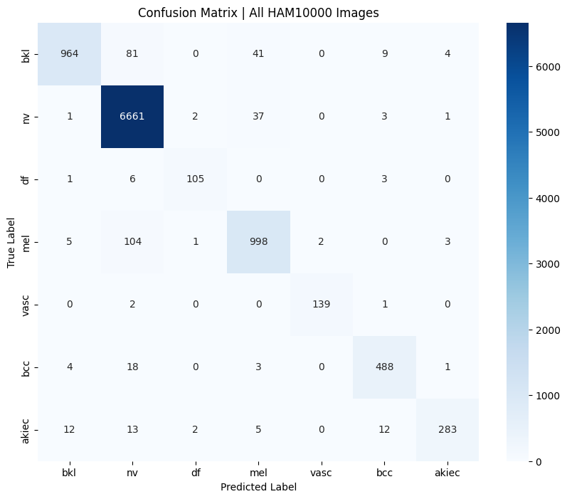
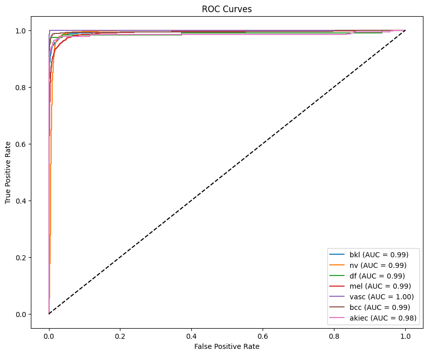
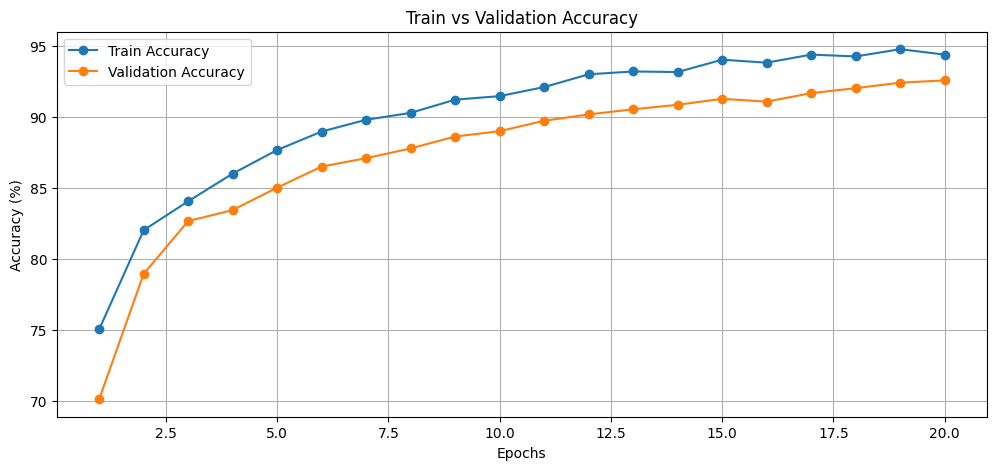
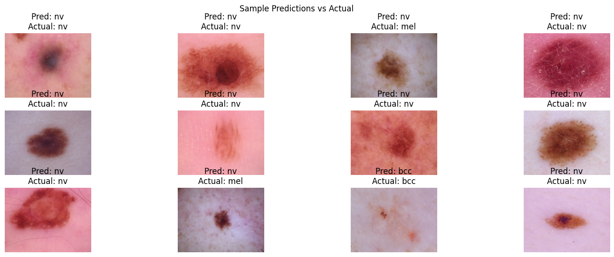

# skin-cancer-classification-mobilenetv2
Deep learning-based skin cancer classification using MobileNetV2 with 96% accuracy

| Class | Precision | Recall | F1-Score |
|-------|----------|--------|----------|
| bkl   | 0.98     | 0.88   | 0.92     |
| nv    | 0.97     | 0.99   | 0.98     |
| df    | 0.95     | 0.91   | 0.93     |
| mel   | 0.92     | 0.90   | 0.91     |
| vasc  | 0.99     | 0.98   | 0.98     |
| bcc   | 0.95     | 0.95   | 0.95     |
| akiec | 0.97     | 0.87   | 0.91     |
| **Overall** | **0.96** | **0.96** | **0.96** |

## 📊 Results Visualization

## 🚀 Project Overview

This project classifies dermoscopic skin lesion images into **7 categories** using a
deep learning pipeline built with **MobileNetV2** and **PyTorch**.
The model was trained and evaluated on the **HAM10000 dataset (~10,000 images)**.

